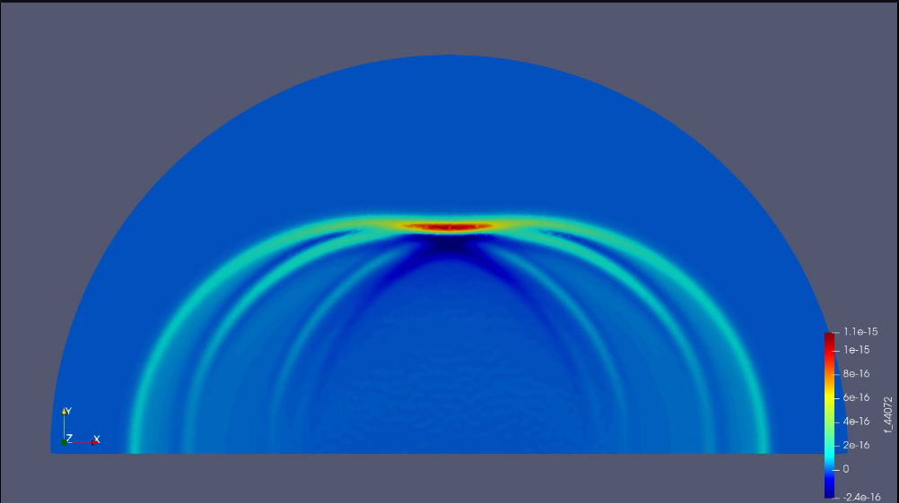

# Wave_dispersion_and_focusing

## Project Goal

The objective of the project is to simulate wave focusing. We consider a semicircular region with three openings, in each opening we place a pulse and we study its propagation throughout the region.

## Solution

To solve the problem, it was necessary to divide it into several stages.

1. Mathematical modeling of the problem
2. Description of the region and meshing
3. Numerical solution using FEM
4. Interpretation of the results
